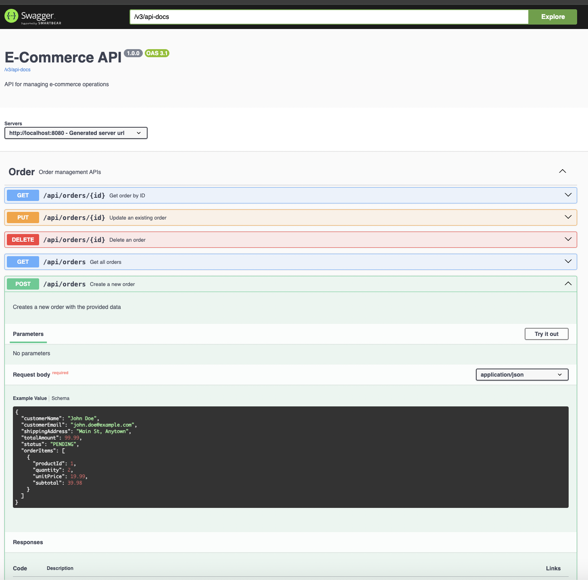

# Spring Boot CRUD Web Application

A modern web application built with Spring Boot 3.4 and Java 21, providing a complete CRUD API for an e-commerce system.

## Table of Contents

- [Overview](#overview)
- [Technology Stack](#technology-stack)
- [API Documentation](#api-documentation)
- [Getting Started](#getting-started)
  - [Prerequisites](#prerequisites)
  - [Installation](#installation)
- [Running the Application](#running-the-application)
  - [Local Development](#local-development)
  - [Docker Deployment](#docker-deployment)
- [Testing](#testing)
  - [Running Tests](#running-tests)
  - [Test Coverage](#test-coverage)
- [Project Structure](#project-structure)

## Overview

This application offers a RESTful API for managing an e-commerce system. It provides full CRUD operations for products, orders, and related entities.

## Technology Stack

- **Java 21**
- **Spring Boot 3.4.4**
- **Spring Data JPA**
- **PostgreSQL** (Production)
- **H2 Database** (Development/Testing)
- **Gradle**
- **Docker & Docker Compose**
- **Swagger/OpenAPI** for API documentation
- **JUnit 5 & Mockito** for testing

## API Documentation

The API is documented using Swagger/OpenAPI:

- Swagger UI: http://localhost:8080/swagger-ui.html
- OpenAPI JSON: http://localhost:8080/v3/api-docs

### Available Endpoints

| Resource | Method | Endpoint | Description |
|----------|--------|----------|-------------|
| **Products** | GET | `/api/products` | Get all products |
| | GET | `/api/products/{id}` | Get product by ID |
| | POST | `/api/products` | Create a new product |
| | PUT | `/api/products/{id}` | Update an existing product |
| | DELETE | `/api/products/{id}` | Delete a product |
| **Orders** | GET | `/api/orders` | Get all orders |
| | GET | `/api/orders/{id}` | Get order by ID |
| | POST | `/api/orders` | Create a new order |
| | PUT | `/api/orders/{id}` | Update an existing order |
| | DELETE | `/api/orders/{id}` | Delete an order |
| **Order Items** | GET | `/api/order-items` | Get all order items |
| | GET | `/api/order-items/{id}` | Get order item by ID |
| | POST | `/api/order-items` | Create a new order item |
| | PUT | `/api/order-items/{id}` | Update an order item |
| | DELETE | `/api/order-items/{id}` | Delete an order item |

For detailed API specifications, request/response formats, and examples, see the Swagger UI documentation.



## Getting Started

### Prerequisites

- Java 21 or later
- Gradle 8+ (or use the included Gradle wrapper)
- Docker and Docker Compose (for containerized deployment)

### Installation

1. Clone the repository:
   ```
   git clone https://github.com/joelcris/springboot-crud-web-app.git
   cd springboot-crud-web-app
   ```

2. Build the application:
   ```
   ./gradlew clean build
   ```

## Running the Application

### Local Development

1. Run the application with H2 database (default profile):
   ```
   ./gradlew bootRun
   ```

   The application will start on http://localhost:8080 with the H2 in-memory database.
   
   Access the H2 console at http://localhost:8080/h2-console with:
   - JDBC URL: `jdbc:h2:mem:ecommercedb`
   - Username: `sa`
   - Password: `password`

2. Run with PostgreSQL profile (requires PostgreSQL instance):
   ```
   ./gradlew bootRun --args='--spring.profiles.active=postgres'
   ```

### Docker Deployment

1. Build and start the containers:
   ```
   docker-compose up --build
   ```

   This will:
   - Build the application using the Dockerfile
   - Start the PostgreSQL database
   - Start the Spring Boot application with the PostgreSQL profile
   - Make the application available on http://localhost:8080

2. View application logs:
   ```
   docker-compose logs -f app
   ```

3. Stop the application:
   ```
   docker-compose down
   ```

## Testing

The application includes a comprehensive test suite. For detailed information about testing, see [TESTING.md](TESTING.md).

### Running Tests

Execute all tests:
```
./gradlew test
```

Run tests for a specific package:
```
./gradlew test --tests "com.webapp.springboot_crud_web_app.repository.*"
./gradlew test --tests "com.webapp.springboot_crud_web_app.service.*"
./gradlew test --tests "com.webapp.springboot_crud_web_app.controller.*"
```

Run a specific test class:
```
./gradlew test --tests "com.webapp.springboot_crud_web_app.repository.ProductRepositoryTest"
```

### Test Coverage

The project maintains a high level of test coverage across all layers of the application:

- **Repository Layer**: Tests for data access and persistence operations
- **Service Layer**: Tests for business logic and service operations
- **Controller Layer**: Tests for API endpoints and request/response handling
- **Exception Handling**: Tests for global exception handling and error responses

For comprehensive information about the testing approach, test structure, and coverage details, refer to the [Testing Documentation](TESTING.md).

## Project Structure

The application follows a layered architecture:

- **Controller Layer**: Handles HTTP requests and responses
- **Service Layer**: Contains business logic
- **Repository Layer**: Manages data access
- **Model Layer**: Defines entity classes
- **DTO Layer**: Defines data transfer objects
- **Exception Handling**: Global exception handling and error responses

```
src/main/java/com/webapp/springboot_crud_web_app/
├── controller/        # REST controllers
├── service/           # Business logic
├── repository/        # Data access layer
├── model/             # Entity classes
├── dto/               # Data Transfer Objects
├── exception/         # Exception handling
└── config/            # Configuration classes
``` 